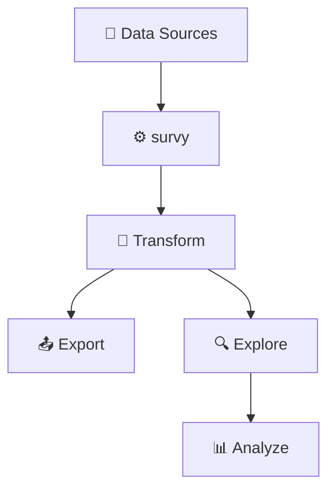

<p align="center">
  
</p>

---

# survy

[](https://pypi.org/project/survy/)
[](LICENSE)
[](https://pypi.org/project/survy/)
[](https://github.com/hoanghaoha/survy/actions)

**A Python library for survey data — treating multiselect questions as first-class variables, not DataFrame workarounds.**



---

## 📋 Table of Contents

- [Why survy?](#-why-survy)
- [Features](#-features)
- [Installation](#-installation)
- [Quick Demo](#-quick-demo)
- [Usage](#-usage)
  - [Understanding Multiselect Formats](#understanding-multiselect-formats)
  - [Load Data](#load-data)
  - [Work with Survey](#work-with-survey)
  - [Work with Variables](#work-with-variables)
  - [Analyze](#analyze)
  - [Export](#export)
- [Agent Skills](#-agent-skills)
- [Design Philosophy](#-design-philosophy)
- [Contributing](#-contributing)
- [License](#-license)
- [References](#-references)

---

## 📦 Why survy?

Survey data has a construct that no general-purpose Python tool handles correctly: **multiselect questions** — "choose all that apply" questions where one respondent selects multiple answers. Raw data stores these as either multiple columns (`hobby_1`, `hobby_2`, `hobby_3`) or delimited strings (`"Sport;Book"`), but pandas treats them as unrelated columns or plain text. Every project, you rewrite the same boilerplate to split, group, count, and export them — and get it subtly wrong (counting *responses* instead of *respondents*, losing column groupings, breaking on format changes).

SPSS solved this decades ago with native multiple response sets. R has partial solutions scattered across `expss`, `MRCV`, and `surveydata`. But Python — the language AI coding tools actually generate — had nothing.

survy makes `MULTISELECT` a first-class variable type. Load your data, and survy auto-detects the format, merges columns into logical variables, and carries that type awareness through frequencies, crosstabs, filtering, and export. The correct code is also the simple code — which means AI assistants can generate it reliably too.

---

## ✨ Features

- 🔹 Multiselect as a first-class concept — both compact and wide formats auto-detected
- 🔹 Read & write multiple formats: CSV, Excel, JSON, SPSS
- 🔹 Built-in tools for validation, tracking, and analysis
- 🔹 Cross-tabulation with significance testing
- 🔹 AI-ready — pair with [survy-agent-skills](https://github.com/hoanghaoha/survy-agent-skills) so LLM coding assistants generate correct `survy` code

---

## 🚀 Installation

```bash
pip install survy
```

---

## ⚡ Quick Demo

```python
import survy

# Load a CSV with wide multiselect columns (hobby_1, hobby_2, ...)
survey = survy.read_csv("data.csv")

# Or load a CSV with compact multiselect columns ("Sport;Book")
survey = survy.read_csv("data_compact.csv", auto_detect=True, compact_separator=";")

print(survey)
# Survey (4 variables)
#   Variable(id=gender, label=gender, value_indices={'Female': 1, 'Male': 2}, base=3)
#   Variable(id=yob, label=yob, value_indices={}, base=3)
#   Variable(id=hobby, label=hobby, value_indices={'Book': 1, 'Movie': 2, 'Sport': 3}, base=3)
#   Variable(id=animal, label=animal, value_indices={'Cat': 1, 'Dog': 2}, base=3)

# Both formats produce the same result
print(survey.get_df())
# ┌────────┬──────┬────────────────────┬────────────────┐
# │ gender ┆ yob  ┆ hobby              ┆ animal         │
# │ ---    ┆ ---  ┆ ---                ┆ ---            │
# │ str    ┆ i64  ┆ list[str]          ┆ list[str]      │
# ╞════════╪══════╪════════════════════╪════════════════╡
# │ Male   ┆ 2000 ┆ ["Book", "Sport"]  ┆ ["Cat", "Dog"] │
# │ Female ┆ 1999 ┆ ["Movie", "Sport"] ┆ ["Dog"]        │
# │ Male   ┆ 1998 ┆ ["Movie"]          ┆ ["Cat"]        │
# └────────┴──────┴────────────────────┴────────────────┘

# Frequencies
print(survey["gender"].frequencies)
# ┌────────┬───────┬────────────┐
# │ gender ┆ count ┆ proportion │
# │ ---    ┆ ---   ┆ ---        │
# │ str    ┆ u32   ┆ f64        │
# ╞════════╪═══════╪════════════╡
# │ Female ┆ 1     ┆ 0.333333   │
# │ Male   ┆ 2     ┆ 0.666667   │
# └────────┴───────┴────────────┘

# Crosstab with significance testing
print(survy.crosstab(survey["gender"], survey["hobby"]))
# {'Total': shape: (3, 3)
# ┌───────┬──────────┬────────────┐
# │ hobby ┆ Male (A) ┆ Female (B) │
# │ ---   ┆ ---      ┆ ---        │
# │ str   ┆ str      ┆ str        │
# ╞═══════╪══════════╪════════════╡
# │ Book  ┆ 1        ┆ 0          │
# │ Movie ┆ 1        ┆ 1          │
# │ Sport ┆ 1        ┆ 1          │
# └───────┴──────────┴────────────┘}
```

---

## 📥 Usage

### Understanding Multiselect Formats

The key challenge with survey data is **multiselect questions** — questions where a respondent can choose multiple answers. Raw data encodes these in two different layouts, and survy handles both.

**Wide format** spreads each answer across its own column, using a shared prefix plus a separator and numeric suffix (e.g. `_1`, `_2`, ...):

| gender | yob  | hobby_1 | hobby_2 | hobby_3 | animal_1 | animal_2 |
|--------|------|---------|---------|---------|----------|----------|
| Male   | 2000 | Book    |         | Sport   | Cat      | Dog      |
| Female | 1999 |         | Movie   |         |          | Dog      |
| Male   | 1998 |         | Movie   |         | Cat      |          |

survy groups columns by parsing the name with a `name_pattern` template (default `"id(_multi)?"`). The tokens `id` and `multi` are named placeholders, and `_`, `.`, `:` are recognized separators. So `hobby_1` is parsed as `id="hobby"`, `multi="1"` — all columns sharing the same `id` are merged into one multiselect variable. This happens automatically — no extra parameters needed.

**Compact format** stores all selected answers in a single cell, joined by a separator (typically `;`):

| gender | yob  | hobby        | animal   |
|--------|------|--------------|----------|
| Male   | 2000 | Book;Sport   | Cat;Dog  |
| Female | 1999 | Movie;Sport  | Dog      |
| Male   | 1998 | Movie        | Cat      |

survy splits these cells on the separator to recover individual choices. Because a semicolon could be regular text, compact format is **not** auto-detected by default — you must either list the compact columns with `compact_ids` or enable `auto_detect=True`.

**After reading**, both formats produce the exact same internal representation — a `MULTISELECT` variable with a sorted list of chosen values per respondent.

---

### Load Data

```python
# Available read functions
survy.read_csv       # CSV files
survy.read_excel     # Excel files (.xlsx)
survy.read_json      # survy-format JSON
survy.read_polars    # Polars DataFrame already in memory
```

#### CSV / Excel

```python
# Wide format — auto-detected, no special parameters needed
survey = survy.read_csv("data.csv")

# Compact format — explicitly specify which columns are compact
survey = survy.read_csv(
    "data_compact.csv",
    compact_ids=["hobby", "animal"],  # columns that use compact encoding
    compact_separator=";",            # delimiter inside cells
)

# Compact format — let survy scan for the separator automatically
survey = survy.read_csv(
    "data_compact.csv",
    auto_detect=True,          # scans all columns for the separator
    compact_separator=";",
)

# Mixed: some columns are wide, some are compact
# Wide is always auto-detected; just specify the compact ones
survey = survy.read_csv("data_mixed.csv", compact_ids=["Q5"], compact_separator=";")

# Custom name_pattern for wide detection if columns use a different naming convention
# Tokens: "id" (base name), "multi" (suffix). Separators: _ . :
# Example: "id.multi" would match "Q1.1", "Q1.2", etc.
survey = survy.read_csv("data.csv", name_pattern="id.multi")

# Excel — identical API
survey = survy.read_excel("data.xlsx", auto_detect=True, compact_separator=";")
```

> **Important:** Do not combine `auto_detect=True` with `compact_ids` in the same call. Use one approach or the other.

#### JSON

The JSON file must follow survy's format — a `"variables"` array where each entry has `"id"`, `"data"`, `"label"`, and `"value_indices"`:

```python
# Expected format: data.json
# {
#     "variables": [
#         {
#             "id": "gender",
#             "data": ["Male", "Female", "Male"],
#             "label": "",
#             "value_indices": {"Female": 1, "Male": 2}
#         },
#         {
#             "id": "yob",
#             "data": [2000, 1999, 1998],
#             "label": "",
#             "value_indices": {}
#         },
#         {
#             "id": "hobby",
#             "data": [["Book", "Sport"], ["Movie", "Sport"], ["Movie"]],
#             "label": "",
#             "value_indices": {"Book": 1, "Movie": 2, "Sport": 3}
#         }
#     ]
# }

survey = survy.read_json("data.json")
```

The `"data"` field varies by type: a flat list of strings for SELECT, a flat list of numbers for NUMBER, and a list of lists for MULTISELECT. The `"value_indices"` field should be `{}` for NUMBER variables.

#### Polars DataFrame

```python
import polars

df = polars.DataFrame({
    "gender": ["Male", "Female", "Male"],
    "yob": [2000, 1999, 1998],
    "hobby": ["Sport;Book", "Sport;Movie", "Movie"],
    "animal_1": ["Cat", "", "Cat"],
    "animal_2": ["Dog", "Dog", ""],
})

# Supports the same parameters as read_csv: compact_ids, auto_detect, name_pattern
survey = survy.read_polars(df, auto_detect=True, compact_separator=";")
```

---

### Work with Survey

```python
print(survey)
# Survey (4 variables)
#   Variable(id=gender, label=gender, value_indices={'Female': 1, 'Male': 2}, base=3)
#   Variable(id=yob, label=yob, value_indices={}, base=3)
#   Variable(id=hobby, label=hobby, value_indices={'Book': 1, 'Movie': 2, 'Sport': 3}, base=3)
#   Variable(id=animal, label=animal, value_indices={'Cat': 1, 'Dog': 2}, base=3)
```

#### Methods & Properties

| Method / Property | Description |
|-------------------|-------------|
| `get_df()` | Return survey data as a `polars.DataFrame` |
| `update()` | Update metadata (labels, value indices) of variables |
| `add()` | Add a variable to the survey |
| `drop()` | Remove a variable from the survey |
| `filter()` | Filter respondents by variable values (returns a new Survey) |
| `sort()` | Sort variables by given logic |
| `to_csv()` | Export to CSV (3 files: data + variable info + value mappings) |
| `to_excel()` | Export to Excel (same structure as CSV) |
| `to_json()` | Export to JSON |
| `to_spss()` | Export to SPSS format (.sav + .sps) |
| `.variables` | Collection of all variables |
| `.sps` | Render SPSS syntax string |

#### DataFrame Output Formats

The `get_df()` method supports flexible output through `select_dtype` and `multiselect_dtype` parameters:

```python
# Compact multiselect (list columns) — default
print(survey.get_df(select_dtype="text", multiselect_dtype="compact"))
# ┌────────┬──────┬────────────────────┬────────────────┐
# │ gender ┆ yob  ┆ hobby              ┆ animal         │
# │ ---    ┆ ---  ┆ ---                ┆ ---            │
# │ str    ┆ i64  ┆ list[str]          ┆ list[str]      │
# ╞════════╪══════╪════════════════════╪════════════════╡
# │ Male   ┆ 2000 ┆ ["Book", "Sport"]  ┆ ["Cat", "Dog"] │
# │ Female ┆ 1999 ┆ ["Movie", "Sport"] ┆ ["Dog"]        │
# │ Male   ┆ 1998 ┆ ["Movie"]          ┆ ["Cat"]        │
# └────────┴──────┴────────────────────┴────────────────┘

# Wide text format (split columns, numeric category codes)
print(survey.get_df(select_dtype="number", multiselect_dtype="text"))
# ┌────────┬──────┬─────────┬─────────┬─────────┬──────────┬──────────┐
# │ gender ┆ yob  ┆ hobby_1 ┆ hobby_2 ┆ hobby_3 ┆ animal_1 ┆ animal_2 │
# │ ---    ┆ ---  ┆ ---     ┆ ---     ┆ ---     ┆ ---      ┆ ---      │
# │ i64    ┆ i64  ┆ str     ┆ str     ┆ str     ┆ str      ┆ str      │
# ╞════════╪══════╪═════════╪═════════╪═════════╪══════════╪══════════╡
# │ 2      ┆ 2000 ┆ Book    ┆ null    ┆ Sport   ┆ Cat      ┆ Dog      │
# │ 1      ┆ 1999 ┆ null    ┆ Movie   ┆ Sport   ┆ null     ┆ Dog      │
# │ 2      ┆ 1998 ┆ null    ┆ Movie   ┆ null    ┆ Cat      ┆ null     │
# └────────┴──────┴─────────┴─────────┴─────────┴──────────┴──────────┘

# Fully numeric (binary-encoded multiselect)
print(survey.get_df(select_dtype="number", multiselect_dtype="number"))
# ┌────────┬──────┬─────────┬─────────┬─────────┬──────────┬──────────┐
# │ gender ┆ yob  ┆ hobby_1 ┆ hobby_2 ┆ hobby_3 ┆ animal_1 ┆ animal_2 │
# │ ---    ┆ ---  ┆ ---     ┆ ---     ┆ ---     ┆ ---      ┆ ---      │
# │ i64    ┆ i64  ┆ i8      ┆ i8      ┆ i8      ┆ i8       ┆ i8       │
# ╞════════╪══════╪═════════╪═════════╪═════════╪══════════╪══════════╡
# │ 2      ┆ 2000 ┆ 1       ┆ 0       ┆ 1       ┆ 1        ┆ 1        │
# │ 1      ┆ 1999 ┆ 0       ┆ 1       ┆ 1       ┆ 0        ┆ 1        │
# │ 2      ┆ 1998 ┆ 0       ┆ 1       ┆ 0       ┆ 1        ┆ 0        │
# └────────┴──────┴─────────┴─────────┴─────────┴──────────┴──────────┘
```

#### Updating Survey Metadata

```python
survey.update(
    [
        {"id": "gender", "label": "Please indicate your gender."},
        {"id": "hobby", "value_indices": {"Sport": 1, "Book": 2, "Movie": 3}},
    ]
)
print(survey)
# Survey (4 variables)
#   Variable(id=gender, label=Please indicate your gender., value_indices={'Female': 1, 'Male': 2}, base=3)
#   Variable(id=yob, label=yob, value_indices={}, base=3)
#   Variable(id=hobby, label=hobby, value_indices={'Sport': 1, 'Book': 2, 'Movie': 3}, base=3)
#   Variable(id=animal, label=animal, value_indices={'Cat': 1, 'Dog': 2}, base=3)
```

#### Adding, Dropping, Sorting, and Filtering

```python
import polars

# Add a variable (auto-wrapped from polars.Series)
survey.add(polars.Series("region", ["North", "South", "North"]))

# Drop a variable (silently ignored if not found)
survey.drop("region")

# Sort variables in-place
survey.sort()                                      # alphabetical by id
survey.sort(key=lambda v: v.base, reverse=True)    # by response count

# Filter respondents — returns a new Survey, original is not mutated
filtered = survey.filter("hobby", ["Sport", "Book"])
filtered = survey.filter("gender", "Male")         # single value also works
```

For multiselect variables, `filter()` keeps a row if **any** of its selected values appears in the filter list.

---

### Work with Variables

```python
hobby = survey["hobby"]
print(hobby)
# Variable(id=hobby, label=hobby, value_indices={'Book': 1, 'Movie': 2, 'Sport': 3}, base=3)
```

#### Methods & Properties

| Method / Property | Description |
|-------------------|-------------|
| `get_df()` | Return variable data as a `polars.DataFrame` |
| `to_dict()` | Serialize variable to a dictionary |
| `replace()` | Remap values using a given mapping |
| `.series` | Variable data as a `polars.Series` |
| `.id` | Variable identifier (read/write) |
| `.label` | Variable label string (read/write) |
| `.value_indices` | Mapping of response values to numeric codes (read/write) |
| `.vtype` | Variable type: `select`, `multi_select`, or `number` |
| `.base` | Count of valid (non-null) responses |
| `.len` | Total number of responses |
| `.dtype` | Underlying Polars data type |
| `.frequencies` | DataFrame of counts and proportions per value |
| `.sps` | SPSS syntax string for this variable |

#### Variable DataFrame Formats

```python
hobby = survey["hobby"]

# Compact (list column)
hobby.get_df("compact")
# shape: (3, 1)
# ┌────────────────────┐
# │ hobby              │
# │ ---                │
# │ list[str]          │
# ╞════════════════════╡
# │ ["Book", "Sport"]  │
# │ ["Movie", "Sport"] │
# │ ["Movie"]          │
# └────────────────────┘

# Wide text (split columns)
hobby.get_df("text")
# shape: (3, 3)
# ┌─────────┬─────────┬─────────┐
# │ hobby_1 ┆ hobby_2 ┆ hobby_3 │
# │ ---     ┆ ---     ┆ ---     │
# │ str     ┆ str     ┆ str     │
# ╞═════════╪═════════╪═════════╡
# │ Book    ┆ null    ┆ Sport   │
# │ null    ┆ Movie   ┆ Sport   │
# │ null    ┆ Movie   ┆ null    │
# └─────────┴─────────┴─────────┘

# Binary-encoded (split columns, 0/1)
hobby.get_df("number")
# shape: (3, 3)
# ┌─────────┬─────────┬─────────┐
# │ hobby_1 ┆ hobby_2 ┆ hobby_3 │
# │ ---     ┆ ---     ┆ ---     │
# │ i8      ┆ i8      ┆ i8      │
# ╞═════════╪═════════╪═════════╡
# │ 1       ┆ 0       ┆ 1       │
# │ 0       ┆ 1       ┆ 1       │
# │ 0       ┆ 1       ┆ 0       │
# └─────────┴─────────┴─────────┘
```

#### Updating Variables

```python
hobby.value_indices = {"Sport": 1, "Book": 2, "Movie": 3}
hobby.label = "Please tell us your hobbies."
print(hobby)
# Variable(id=hobby, label=Please tell us your hobbies., value_indices={'Sport': 1, 'Book': 2, 'Movie': 3}, base=3)

# Remap values — works for both SELECT and MULTISELECT
hobby.replace({"Book": "Reading"})
print(hobby)
# Variable(id=hobby, label=Please tell us your hobbies., value_indices={'Movie': 1, 'Reading': 2, 'Sport': 3}, base=3)
```

> **Note:** The `value_indices` setter validates that your mapping covers every value present in the data. If any value is missing, it raises a `DataStructureError`.

---

### Analyze

#### Frequency Table

```python
print(survey["gender"].frequencies)
# ┌────────┬───────┬────────────┐
# │ gender ┆ count ┆ proportion │
# │ ---    ┆ ---   ┆ ---        │
# │ str    ┆ u32   ┆ f64        │
# ╞════════╪═══════╪════════════╡
# │ Female ┆ 1     ┆ 0.333333   │
# │ Male   ┆ 2     ┆ 0.666667   │
# └────────┴───────┴────────────┘
```

#### Cross-tabulation

The `survy.crosstab()` function supports count, percent, and numeric aggregations, with optional significance testing and filtering.

**Signature:**

```python
survy.crosstab(
    column,           # Column variable — the grouping dimension (e.g., gender)
    row,              # Row variable — the analyzed dimension (e.g., hobby)
    filter=None,      # Optional variable to segment into multiple tables
    aggfunc="count",  # "count", "percent", "mean", "median", or "sum"
    alpha=0.05,       # Significance level for statistical tests
)
# Returns: dict[str, polars.DataFrame]
# Key is "Total" when no filter, or each filter-value when filter is provided
```

**Count:**

```python
print(survy.crosstab(survey["gender"], survey["hobby"], aggfunc="count"))
# {'Total': shape: (3, 3)
# ┌───────┬──────────┬────────────┐
# │ hobby ┆ Male (A) ┆ Female (B) │
# │ ---   ┆ ---      ┆ ---        │
# │ str   ┆ str      ┆ str        │
# ╞═══════╪══════════╪════════════╡
# │ Book  ┆ 1        ┆ 0          │
# │ Movie ┆ 1        ┆ 1          │
# │ Sport ┆ 1        ┆ 1          │
# └───────┴──────────┴────────────┘}
```

**Percent:**

```python
print(survy.crosstab(survey["gender"], survey["hobby"], aggfunc="percent"))
# {'Total': shape: (3, 3)
# ┌───────┬──────────┬────────────┐
# │ hobby ┆ Male (A) ┆ Female (B) │
# │ ---   ┆ ---      ┆ ---        │
# │ str   ┆ str      ┆ str        │
# ╞═══════╪══════════╪════════════╡
# │ Book  ┆ 0.5      ┆ 0.0        │
# │ Movie ┆ 0.5      ┆ 1.0        │
# │ Sport ┆ 0.5      ┆ 1.0        │
# └───────┴──────────┴────────────┘}
```

**Mean (numeric variable):**

```python
print(survy.crosstab(survey["gender"], survey["yob"], aggfunc="mean"))
# {'Total': shape: (1, 3)
# ┌─────┬─────────┬─────────┐
# │ yob ┆ Female  ┆ Male    │
# │ --- ┆ ---     ┆ ---     │
# │ str ┆ str     ┆ str     │
# ╞═════╪═════════╪═════════╡
# │ yob ┆ 1999.0  ┆ 1999.0  │
# └─────┴─────────┴─────────┘}
```

**With filter variable** (produces one table per filter category):

```python
print(
    survy.crosstab(
        survey["gender"],
        survey["hobby"],
        filter=survey["animal"],
        aggfunc="count",
    )
)
# {'Cat': shape: (3, 2)
# ┌───────┬──────────┐
# │ hobby ┆ Male (A) │
# ...
# 'Dog': shape: (3, 3)
# ┌───────┬──────────┬────────────┐
# │ hobby ┆ Male (A) ┆ Female (B) │
# ...
# └───────┴──────────┴────────────┘}
```

Significance testing uses a two-proportion z-test for `"count"`/`"percent"` and Welch's t-test for numeric aggregations. Significant differences are indicated by column letter labels (e.g. `"A"`, `"B"`).

---

### Export

All export methods take a **directory path** (not a file path) and an optional `name` parameter for the base filename. Do not pass a full file path like `"output/results.csv"` — pass the directory and use `name=`.

#### CSV / Excel

Writes three files:

- **`{name}_data.csv`** — survey responses (format depends on the `compact` parameter)
- **`{name}_variables_info.csv`** — variable metadata: `id`, `vtype` (SINGLE / MULTISELECT / NUMBER), `label`
- **`{name}_values_info.csv`** — value-to-index mappings: `id`, `text`, `index`

The `compact` parameter (default `False`) controls how multiselect columns appear in the data file. When `False`, multiselect variables are expanded to wide columns (`hobby_1`, `hobby_2`, ...). When `True`, values are joined into a single cell (`"Book;Sport"`).

```python
# Default (compact=False) — multiselect expanded to wide columns
survey.to_csv("output/", name="results")

# Compact mode — multiselect joined into single cells
survey.to_csv("output/", name="results", compact=True, compact_separator=";")

# Excel — identical API, writes .xlsx files instead
survey.to_excel("output/", name="results")
```

#### SPSS

Writes `{name}.sav` (data) and `{name}.sps` (syntax). Requires `pyreadstat`.

```python
survey.to_spss("output/", name="results")

# You can also get the SPSS syntax string directly
print(survey.sps)
# VARIABLE LABELS gender 'gender'.
# VALUE LABELS gender 1 'Female'
# 2 'Male'.
# VARIABLE LEVEL gender (NOMINAL).
# ...
```

#### JSON

Writes `{name}.json` in the same structure that `read_json` expects. The output includes an extra `"vtype"` field per variable that `read_json` ignores on re-read (the type is re-inferred from the data).

```python
survey.to_json("output/", name="results")
```

---

## 🤖 Agent Skills

Structured **agent skills** for `survy` live in a separate repository:
**[survy-agent-skills](https://github.com/hoanghaoha/survy-agent-skills)**.

These are reference documents designed for LLM-based coding assistants like Claude, Copilot, and similar tools. When an AI agent reads them, it can generate correct `survy` code without hallucinating parameters, confusing compact and wide formats, or inventing methods that don't exist.

See the [survy-agent-skills README](https://github.com/hoanghaoha/survy-agent-skills#readme) for installation instructions.

---

## 🧠 Design Philosophy

- Keep survey logic explicit — variables, labels, and value mappings are first-class objects
- Treat multiselect questions as a native data type, not a post-processing concern
- Provide a clean abstraction over high-performance data processing (powered by [Polars](https://pola.rs/))

---

## 🤝 Contributing

Contributions are welcome!
Feel free to open issues or submit pull requests on [GitHub](https://github.com/hoanghaoha/survy).

---

## 📄 License

MIT License — see [LICENSE](LICENSE) for details.

---

## 🔗 References

- Powered by **[Polars](https://pola.rs/)** for fast data processing
